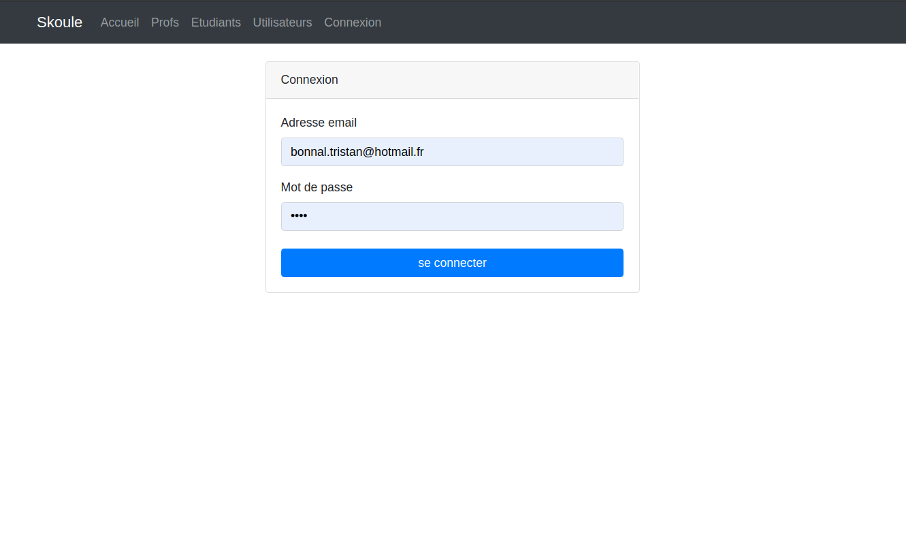

# Skoule :school: :pencil2: :mortar_board:

## The website :computer:

This website was an exercise I had to do during my formation, the purpose was to practice handmade CRUD, router, authentication, authorizations, ACL and CSRF tokens with PHP. Every page require an authentication, and there are different roles levels. Skoule purpose is to see students and teachers lists.





## Stack :wrench:

- PHP 7.4
- Altorouter
- Bootstrap

## How to install project :hammer:

- After cloning the repo, run :
  
    ```bash
    composer install
    ```

- Specify your work environment with the conf.ini file:

    ```bash
    DB_HOST=localhost
    DB_NAME=skoule
    DB_USERNAME=user
    DB_PASSWORD=password
    ```

- Import database with skoule.sql file
- Log with created users :
  - bonnal.tristan@hotmail.fr  password:1234  role:admin
  - user.normal@hotmail.fr  password:1234  role:user
